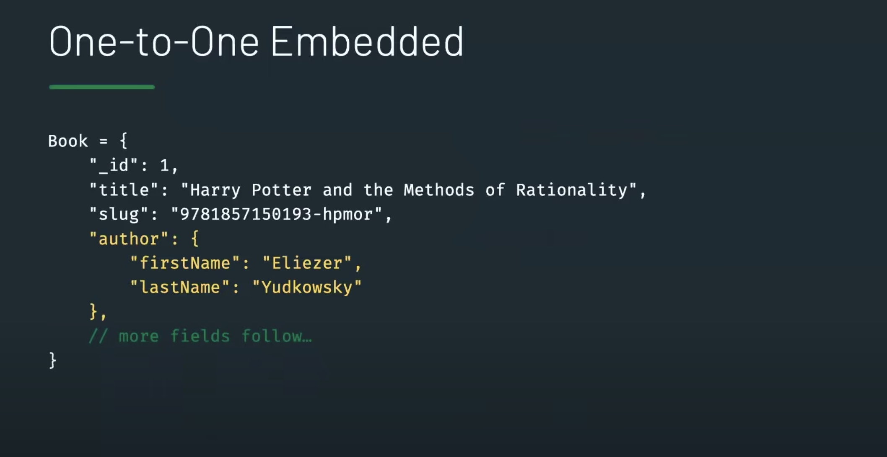

# Table of contents

1. [Introduction](#introduction)
2. [Requirements/tools](#requirement)
   1. [Dependencies](#dependencies)
3. [Get this server running on your local machine](#start)
   1. [Signup for a MongoDB Atlas account](#register)
   2. [Create a .env file](#env)
   3. [Making server requests](#server)

## Intro: The why and what of this project

On a grand scale, our ambition was to provide users with a digital platform that enabled them to list apartments, rent apartments, and manage these apartments using a single interface.
The application code that you find here provides a custom API that grants our client side access to a NoSQL document database running on mongoDB Atlas.

The rest of this README is intended to guide you on how you can clone and run this server on your local machine.
A production version is currently hosted on Heroku.

Its important to mention that this is a continuing project, and as such, we are constantly recreating this codebase inorder to consistently serve the needs of our client front. This agile approach was one of the motivations for why we decided to look into document databases.

## Requirements/tools 

- All you need is a working laptop/desktop with access to the internet.
- A mongoDB Atlas account (follow the steps [here](#register) to get a free account)

### Dependencies for running Dev Server 

- Eslint (for code linting.)
- Jest and supertest (for testing)
- cors (for cross resource referencing)
- dotenv (for managing environmental configuration)
- express
- mongoose
- nodemon

## Get this server running on your local machine 

#### Running the Development Server

1. clone the repository to your local machine with `git clone (url)`- you can do this from your home directory or ~ cd/home/Desktop
2. Open the cloned folder in your favorite IDE, preferrably VScode - ~ cd/home/Desktop/backend2
3. Run `npm install` to install all of the dependencies as listed under the dependency section above

##### Signup for a MongoDB Atlas account 

4. Go to `https://www.mongodb.com/atlas/database`and signup for a free Atlas account- you can signin with your gmail.
5. Select the free option from the 'deploy a cloud database' option window
6. Pick the cloud provider and location closest to your location, and create the cluster.
7. Wait for the cluster to be ready for use. This can takes some minutes.(do not continue before the cluster is ready!!)
8. Create a user credential for your database from the security tab (You would need this to enable the application to talk to your database)
9. Click on the Network Access tab and select `allow access from anywhere`
10. Wait for the database deployment page to complete initialization
11. Click on `Connect`
12. choose connect your application (The view displays the MongoDB URI, which is the address of the database that we will supply to the MongoDB client library in our .env file)
13. copy the MongoDB URI.

##### Create a .env file <a name="env">

14. Back in the root of your cloned project folder, create a `.env` file
15. `MONGODB_URI=mongodb+srv://<name>:<password>@cluster0.o1opl.mongodb.net/?retryWrites=true&w=majority PORT=3001`
16. Replace the <name> and <password> parameters in the above step with the user credential information you created in step 8 (without the <>)
17. Ensure all your files are saved.
18. From your project directory, Run `npm run dev`to launch the server on your local machine, with connection to the database.

##### Making server requests <a name="server">

19. install the VScode JSON server extension from the extension tab section on VScode
20. Open the request folder in your folder directory and make a POST request to the database to addd listings
21. test the other requests too.
22. If the extension does not work for you, use Postman. make requests to : http://localhost:3001/api/apartments

### Database design approach

Because we wanted to retain flexibility and scale at the same time, mongodb was our choice database for the following reasons:

- Supports a non-uniform schema design and implementation approach for documents in a collection
- The data in a given document field can be different from those in another document field, even within the same collection
- It supports automatic scaling. Our database can easily change to accommodate the emerging business needs for our client without having prolonged downtimes
- Easy implementation

In our case, we made the decision to store the id's of the apartments created by the user in the user document. Like you would find in the book-author embedded relationship below.

In the above image, books represent our apartments while authors represent our users who create apartment listngs and also rent them. In essence, every apartment must have been added by a user who reserves the right to delete and update the details of such listings.
